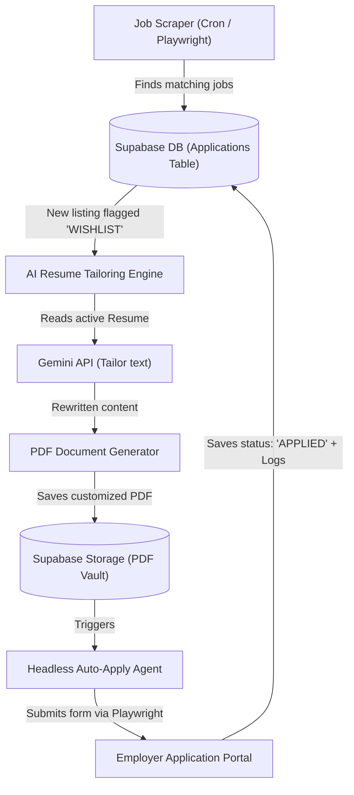

# CareerHQ Autopilot: Automated Job Search & Resume Refinement Roadmap

This document outlines the current capabilities of **CareerHQ** regarding automation, explains what is missing for a fully autonomous "Autopilot" application system, and provides a technical blueprint to build it.

---

## 1. What CareerHQ Currently Supports (The Foundation)

We have built the perfect interactive command center. Currently, the system supports:
* **ATS Scoring & Tailoring Feedback**: You can upload a resume and paste a job description. The AI analyzes it, calculates an ATS match score, and gives you specific keyword and impact tailoring suggestions.
* **Outreach Generation**: You can instantly generate custom cover letters and cold outreach messages tailored to the target role.
* **Habit & Goal Monitoring**: The dashboard tracks your daily targets (e.g., number of applications and follow-ups).
* **Application Lifecycle Tracking**: You can log each job, set status stages, and receive alerts if listings go stale.

> [!NOTE]
> **Summary**: The app provides the *tools* for scoring and drafting, but the execution (reading job boards, rewriting the PDF file, and filling out the application form) is currently **manual**.

---

## 2. Why Autopilot is Not Yet Built (The Challenges)

A fully autonomous **"Auto-Apply & Auto-Refine"** pipeline requires solving three complex challenges:

### A. Autonomous Job Sourcing
* **Challenge**: Scraping platforms like LinkedIn, Indeed, or ZipRecruiter requires continuous session handling, handling CAPTCHAs, and filtering out spam listings.
* **Solution**: Requires integrating headless browser scrapers (Playwright/Puppeteer) or querying developer APIs.

### B. Automated Document Compilation
* **Challenge**: Rewriting the resume text is easy for Gemini, but converting that rewritten text back into a beautifully formatted, recruiter-ready **PDF or DOCX** file dynamically without messing up fonts/spacing is complex.
* **Solution**: Requires integrating PDF document builders (like `react-pdf` or `pdf-lib`) in the Next.js backend.

### C. Headless Form Submission (Auto-Apply)
* **Challenge**: Job application forms (Workday, Greenhouse, Lever, etc.) are highly varied. They ask custom screening questions, require email verification, and demand file uploads.
* **Solution**: Requires a Playwright browser runner powered by an LLM agent that scans the form fields, maps them to your profile data, asks the LLM to write answers for custom screening questions, and submits the form programmatically.

---

## 3. The Blueprint: How We Can Build CareerHQ Autopilot

The diagram below shows how we can build this automated loop on top of your existing CareerHQ database:

### Step 1: Automated Job Scraper (Sourcing)
* **Action**: We create a background worker or cron job that scrapes job listings matching your specified keywords and skills.
* **Outcome**: Automatically creates new rows in your `Application` table under the `WISHLIST` status.

### Step 2: Auto-Tailor & PDF Generator (Refinement)
* **Action**: When a new job is logged:
  1. The API sends your master resume + the new job description to Gemini.
  2. Gemini rewrites the resume (bullet points, summary, skills) targeting a >85% ATS score.
  3. The backend compiles the output into a clean PDF using `pdf-lib` and saves it as a new version in your **Resume Vault** (Supabase Storage).
* **Outcome**: A custom, optimized resume PDF is generated for every single job.

### Step 3: Browser Auto-Apply Agent (Submission)
* **Action**: A background Playwright script runs:
  1. Navigates to the job portal URL.
  2. Detects form inputs (First Name, Email, Resume Upload).
  3. Uploads the tailored PDF.
  4. Feeds custom questions (e.g., *"Why do you want to work here?"*) to Gemini to generate context-aware answers.
  5. Clicks "Submit".
* **Outcome**: Programmatic application submittal.

### Step 4: Autopilot Monitoring Board (Control Center)
* **Action**: Add an **Autopilot Dashboard** tab to your CareerHQ UI:
  * **Toggle Switch**: Turn "Autopilot Mode" ON/OFF.
  * **Activity Stream**: Real-time logs showing what the bot is doing:
    * `[10:14 AM] Found Software Engineer listing at Stripe.`
    * `[10:15 AM] Resume tailored (ATS Score: 92%). PDF generated.`
    * `[10:17 AM] Application submitted to Stripe. Logged as APPLIED.`
  * **Analytics**: Track your daily auto-submittals and average ATS score performance.

---

## 4. How to Get Started

If you want to start building this Autopilot system, we can implement it phase-by-phase:
1. **Phase A (Scraper)**: Build a job board searcher that pulls matching listings directly into your dashboard.
2. **Phase B (Auto-PDF Tailor)**: Add dynamic PDF generation to automatically export custom resumes.
3. **Phase C (Auto-Apply)**: Build the Playwright agent to run form submittals.
